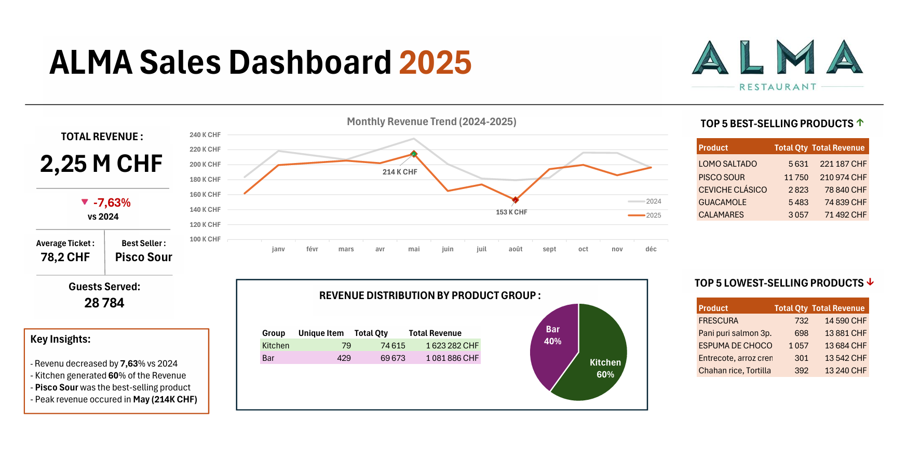
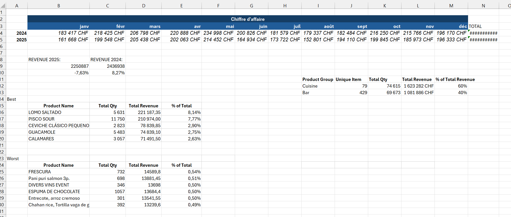

# ALMA Restaurant Sales Analysis

## Project Overview

This project was developed while I was working as a **bartender at ALMA Restaurant in Geneva**.

I built an Excel dashboard to summarize the restaurant's **2025 sales performance** and create a clear reference point for comparing future **2026 results**.

The dashboard focuses on revenue, monthly performance, product sales, average ticket, guest volume, and the contribution of the Bar and Kitchen departments.

---

## Tools Used

- Microsoft Excel
- Excel formulas
- Data preparation
- KPI analysis
- Charts and dashboard design
- Year-over-Year comparison

---

## Sales Dashboard



### Main KPIs

- **Total Revenue:** 2.25M CHF
- **Revenue vs 2024:** -7.63%
- **Average Ticket:** 78.2 CHF
- **Guests Served:** 28,784
- **Best Seller:** Pisco Sour

### Key Findings

- Revenue decreased by **7.63% vs 2024**
- **May** recorded the highest monthly revenue at approximately **214K CHF**
- **Kitchen generated 60%** of revenue, compared with 40% for the Bar
- **Pisco Sour** was the highest-volume product

---

## Data Preparation

A supporting Excel sheet was used to prepare the calculations behind the dashboard.



It includes:

- 2024 vs 2025 monthly revenue
- Annual revenue totals
- YoY revenue variation
- Product rankings by quantity and revenue
- Kitchen vs Bar revenue distribution
- Best- and lowest-selling products

---

## Purpose

The dashboard provides a clear summary of **2025 restaurant performance** and establishes a baseline for comparing **2026 results**.

---

## Limitations

- The analysis focuses on sales performance rather than profitability.
- Product margins and costs were not included.
- Factors such as promotions, menu changes, events, pricing changes, and seasonality were not analyzed separately.
- 2025 results provide a historical reference point but do not explain the causes behind changes in sales.

---

## Repository Structure

```text
alma-sales-analysis/
│
├── README.md
├── ALMA_Sales_Analysis.xlsx
│
└── screenshots/
    ├── alma_dashboard.png
    └── alma_data_prep.png
```

---

## Author

**Maxime Orlhac**

Data / Business Analyst Portfolio Project
